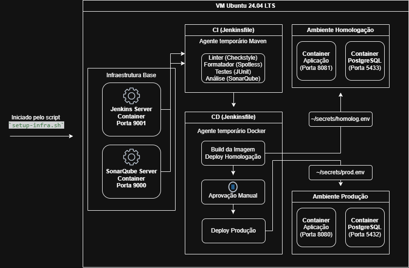

# Sistema de Cadastro de Receitas

Este projeto foi desenvolvido como um trabalho acadêmico com o objetivo prático de implementar uma esteira de integração e entrega contínua (CI/CD) e realizar o deploy automatizado da aplicação.

A aplicação consiste em um sistema simples de cadastro de usuários e receitas. As receitas possuem categorias, filtros por nome e categoria, autenticação via token JWT e funcionalidade para exportar os dados em formato PDF.

## Arquitetura


## Tecnologias Utilizadas

* **Backend:** Java v21 e Spring Boot v4.0.5
* **Banco de Dados:** PostgreSQL v16 (ambientes de homologação e produção) e H2 (ambiente de testes)
* **Validação de Código:** SonarQube, Checkstyle e Spotless
* **CI/CD:** Jenkins
* **Orquestração e Deploy:** Docker e Docker Compose
* **Versionamento:** Git e Github
* **Automação:** Scripts Shell (.sh)
* **Sistema Operacional:** Ubuntu 24.04 LTS

## Funcionamento da Esteira (CI/CD)

O fluxo de automação está configurado no arquivo `Jenkinsfile` e utiliza agentes Docker temporários para isolar cada etapa do processo:

1. **Fase de Testes e Build:** Utiliza um contêiner Maven para rodar o linter (`Checkstyle`), a verificação de formatação (`Spotless`) e os testes unitários da aplicação.
2. **Análise de Qualidade:** Envia o código para o servidor do SonarQube (Container Local) para análise.
3. **Deploy em Homologação:** Constrói a imagem Docker da aplicação e inicializa os contêineres de homologação usando um arquivo compose específico.
4. **Espera para Produção:** A esteira pausa e aguarda uma confirmação manual no Jenkins.
5. **Deploy em Produção:** Após a aprovação manual, atualiza o ambiente de produção.

## Como Executar o Projeto (Deploy em VM Ubuntu 24.04 LTS)

A execução deste projeto foi estruturada para rodar numa Máquina Virtual utilizando o sistema operacional Ubuntu 24.04 LTS. Todo o processo de configuração e deploy é automatizado através de scripts.

### Pré-requisitos do Ambiente

Antes de iniciar a execução, é necessário organizar os arquivos na máquina virtual da seguinte forma:

1. **Diretório de Secrets:** Crie uma pasta chamada `secrets` no diretório raiz do seu usuário (ex: `~/secrets/`). Dentro dela, crie os arquivos `homolog.env` e `prod.env` com as variáveis de ambiente necessárias (credenciais de banco de dados, chaves JWT, etc.). O `Jenkinsfile` realiza a leitura e injeção destes arquivos durante o deploy.
2. **Scripts de Execução:** Copie todos os scripts presentes na pasta `scripts` do repositório para a raiz do diretório do usuário na VM.

### Fluxo de Execução dos Scripts

Com os arquivos posicionados, a execução deve seguir a ordem abaixo:

#### 1. Preparação da Infraestrutura (`setup-infra.sh`)
O primeiro passo é inicializar as ferramentas que compõem o ecossistema de CI/CD.

```bash
chmod +x setup-infra.sh
./setup-infra.sh
```

* **O que faz:** Este script inicializa e provisiona os contêineres base da infraestrutura (como Jenkins e SonarQube). Ele prepara o ambiente para que a esteira possa ser executada.

#### 2. Disparo da Pipeline de Deploy
Com a infraestrutura base rodando, o deploy da aplicação é acionado automaticamente pelo próprio script inicial.

* **O que faz:** O script se comunica via API com o Jenkins, eliminando a necessidade de interação manual com a interface gráfica. Ele identifica a credencial de acesso, negocia o token de segurança (Crumb) e envia o comando para iniciar a pipeline definida no `Jenkinsfile`.

## Detalhes de Configuração
* **Isolamento de Ambientes:** Os ambientes de homologação e produção rodam na mesma máquina virtual. O isolamento é feito através da flag `-p` do Docker Compose, mapeando portas diferentes e definindo nomes de projetos distintos para evitar colisões.
* **Gerenciamento de Credenciais:** As senhas e configurações sensíveis de cada ambiente ficam restritas aos arquivos `.env` na pasta de `secrets` da VM, garantindo que informações críticas não sejam expostas no repositório de código. Para o funcionamento correto da aplicação, estes arquivos devem conter obrigatoriamente as seguintes chaves configuradas:
    * `POSTGRES_USER`
    * `POSTGRES_PASSWORD`
    * `EMAIL_USERNAME`
    * `EMAIL_PASSWORD`
    * `JWT_SECRET_KEY`

## Acesso e Portas
Após a execução da infraestrutura e a conclusão da pipeline de deploy, os serviços estarão disponíveis nas seguintes portas (substitua localhost pelo IP da sua VM caso esteja acessando remotamente).

* **Aplicação (Produção):** `http://localhost:8080`
* **Aplicação (Homologação):** `http://localhost:8081`
* **SonarQube:** `http://localhost:9000`
* **Jenkins:** `http://localhost:9001`
